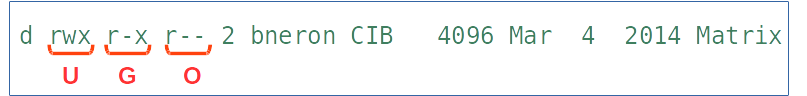
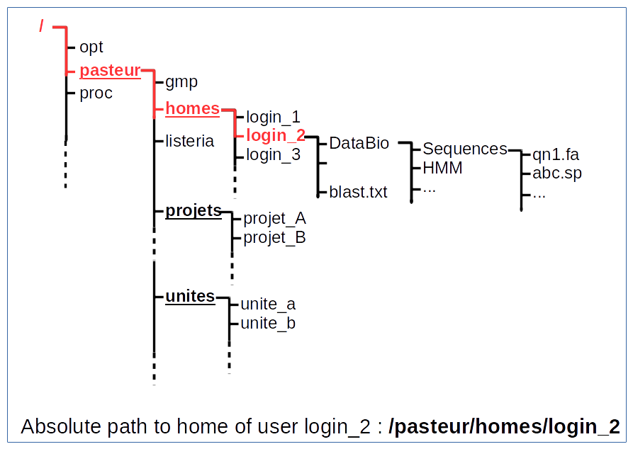

.. _File_System:

***********
File System
***********

File system
===========

* On unix there two important questions to ask before to do anything: 
   
   * who am I ?
   * where am I ?
   
.. rst-class:: build

   * who am I ? 
      * | We will see this later on this course.
        | For now you are the user "unix"
        
   * where am I ?

      * somewhere on the file system !
 

What is the file system
=======================

* Programs store data in files on disks.
* A file system is the way the files are stored on a disk.
* In Unix, the files are organized in a tree structure.

what is a "tree structure"?
===========================

do you already know a tree structure in biology?

.. rst-class:: build

   .. figure:: /_static/images/F1.large.jpg
      :class: align-center
      :width: 500px

file sytem tree structure
=========================

.. figure:: /_static/images/UnixDirectoryTree.png
      :class: align-center
      :width: 450px

.. ifnotslides::
   
   * file system is like a phylogenic tree: it's a hierarchical structure. 
   * ancestrors are replaced by directories and species by files.
   * so it contains directories that contains other directories and/or files.

* where am I?

.. rst-class:: build

      * in a directory.

what directory ?
================

* ``pwd`` (for **p**\ rint **w**\ orking **d**\ irectory)

.. rst-class:: build

   * /home/unix
   
   * This the coordinates of your current position.
   * But what does it mean?

   * To navigate, coordinates are not enough.
   * You need a map!

where am I on the map?
======================

This is my map!

.. figure:: /_static/images/local_file_system.png
      :class: align-center
      :width: 600px
      
* So now, I know where I'am.
* But know, I'd like to explore the map.

let's go for exploration
========================

* I need to know how to move.
* I need how to specify my destination.

.. rst-class:: build

   * how to move?
    
      * ``cd``  (**c**\ hanging **d**\ irectory) 
      * ``cd location``
    
   * how to specify a location?
      
         #. give absolute position of youre destination
         #. give relative path
      
      
absolute path
=============

.. figure:: /_static/images/local_abs_path.png
   :class: align-center
   :width: 700px

abolute path to file *abc_mouse.fa*

exercise:
   use command cd to explore the file systems.

relative path
=============

.. figure:: /_static/images/local_relative_path.png
   :class: align-center
   :width: 600px

so we need to upgrade our location vocalbulary:
    
    * where a I am : **.**
    * one level up : **..**

exercise:
   use command cd to explore the file systems using relative path.

shortcuts
=========

* I want to go home => **cd** or **cd ~**

* I want to go back to my previous location => **cd -**

Exploration
===========

| each machine have it's own map.
| we have not a map for all machines.
| So we have to explore.

what are there in a this directory?

.. rst-class:: build
   
   * ls (list directory contents)

ls
==

* **ls path** (list directory contents display it in lexicographic order)

some useful options:

* ls -l : use a long listing format
* ls -a : do not ignore entries starting with **.** (ls -al)
* ls -d : list directory entries instead of contents
* ls -t : sort by modification time
* ls -r : reverse order while sorting

   * ls -lrt : ???

exrecise:
   go in ~/DataBio/ , explore the subtree 

special characters
==================

When a user want to execute a command on several files with similar names,
or if he don't know the exact names, he can use **jockers**:

* **\*** replace any characters (0 or more characters)
* **?** replace one character (1 character)
* **[...]** specify a set of possible characters
* **[x-y]** allow characters from **x** to **z** in lexicographic order
* **\\** escape any characters

jockers exercises
=================

* ls -l ~/DataBio/Sequences/Nucleique/\*.fasta
* ls -l ~/DataBio/Sequences/Proteique/\*.fasta
* ls -l ~/DataBio/Sequences/Proteique/\*.fasta
* ls -l ~/DataBio/Sequences/\*/

* ls -l ~/DataBio/Sequences/*/q?1.*

how to get the listing of all files like abcd2_mouse.fa or abcd3_human.sp but **NOT**
abcd_result.txt?

create direcotries
==================

* **mkdir path** create a directory. 
* **mkdir -p path** create intermediate directories if necessary.

exercise:

| go in youre home: 
| create a directory 
| go in, create 

copy file and directory
=======================

* **cp file1 file2**
* **cp file1 (file2 ...) directory**
* **cp -r dir1 dir2** 

you can use option -p to preserve rights (owner, group, last acces and modification date) 

mv/rename file/directories
==========================

* **mv src dest** (src and dest are paths) 

you can specifies several src like mv src1 src2 src2 ... dest

mv warning
==========
   
The **mv** command has not the same effect according src and dest are directories or files
   
+--------------+-----------+------------------------------------------------------------+
| src type     | dest type | action                                                     |
+==============+===========+============================================================+
| one file     | file      | the src file is rename into dest file                      |
|              |           | beware if dest file already exists it's lost               |
+--------------+-----------+------------------------------------------------------------+
| several file | file      | all src files are lost only the last one is rename as dest |
+--------------+-----------+------------------------------------------------------------+
| file         | dest      | all src files are moved in dest directory                  |
|              |           | dest directory must exists. If not it is consider as file  |
+--------------+-----------+------------------------------------------------------------+
| dest         | dest      | all src directories are moved in dest directory            |
|              |           | the dest directory must already exists                     |
+--------------+-----------+------------------------------------------------------------+

remove file
===========
 
* **rm file1 file2 file ...** remove files (**Not** directories)
* **rmdir dir1 dir2 ...** remove **empty** directories 
   * empty mean no files even files starting with dot, no directories. 

.. warning::
   by default the user is not asked before to delete a file or not.
   You are big guy, you know what you do.
   
   if you are unsure you can add -i option. In this case you will prompt
   before deleting an item.
    
.. rst-class:: build
   
   * **rm -R directory** delete all files in directory recursively then the directory itself.
   
   
link
====

| In unix as other systems we can create shortcut for files or directory.
| We call them links. There is several kind of links, here we will see only simbolic links.
| when you list a directory (ls -l) they appear like that: ::

   lrwxrwxrwx 1 bneron  bneron      27 Oct 15 13:34 file1 -> /home/bneron/very_big_fasta
 
The command establishing this link is: ::

   ln -s /home/bneron/very_big_fasta file1
   
* ln -s source_file  link_name

We can create a link toward a directory

Permissions
===========

* Unix is a multi-users system. So some users have some rights to do something and some other not.
* The system allow to protect your data form an other user.
* The system allow some users to work in groups.

all this features are managed  by the **permissions** (or right access)

3 classes of permissions
========================

::

   $ ls -l
   total 1176
   drwxr-xr-x 4 bneron CIB   4096 Mar  4  2014 Alignment
   -rw-r--r-- 1 bneron CIB 220196 Mar  4  2014 CIP-55-138_A.b_A06_037.ab1
   drwxr-xr-x 3 bneron bneron   4096 Jun  4 14:51 HMM
   

| **U**: user 
| **G**: group
| **O**: others
| **r**: read      (4)
| **w**: write     (2)
| **x**: execute   (1)
 
rwx what does it really mean?
=============================

+---+---+------------------------+-------------------------------------------------+
|   |   | file                   | directory                                       |
+===+===+========================+=================================================+
| r | 4 | read                   | allow to list                                   |
+---+---+------------------------+-------------------------------------------------+
| w | 3 | write                  | allow to create and delete file and directories |
+---+---+------------------------+-------------------------------------------------+
| x | 1 | the file is executable | allow to enter and pass trhough the directory   |
+---+---+------------------------+-------------------------------------------------+

who am I?
=========

Permisions are based on your identity and the groups to wich you belong.

* **whoami** => give you the login you logged with
* **id  <login>** => give the id and the groups to which the login blong (login is optional) ::

   bneron@bic-t2a:~$id
   uid=2896(bneron) gid=3044(CIB) groups=3044(CIB),87(biok),110(sis),547(mobyle),990(gensoft),3160(vpn-ssl-users),20000(bioweb)
 
* uid is my login
* gid is my primary group
* groups is the list of all groups to which I belongs (max 16 groups).

change permisions
=================

**chmod [ugo] [+-] [rwx] <target>**

::
 
   chmod [ugo] [+-] [rwx] <target>

   drwxr-xr-x 4 bneron CIB   4096 Mar  4  2014 Alignment
   chmod g+w Alignment
   drwxrgxr-x 4 bneron CIB   4096 Mar  4  2014 Alignment
   chmod o-rx
   drwxrgx--- 4 bneron CIB   4096 Mar  4  2014 Alignment
   chmod g-wo+x
   chmod: invalid mode: 'g-wo+x'
   
you can use -R option to apply permision to a directory and recursively to its contents.

change permisions syntax 2
==========================

**chmod num_value <target>**

change permissions by default
=============================

umask 
 
change owner/group
==================

File system on Pasteur server
=============================

   
abolute path to home of user login_2 : /pasteur/homes/login_2
   
drwxr-xr-x 9 bneron sis 192 Aug 27  2009 DataBio/

