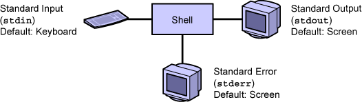

.. _Chain_commands:

**************
Chain commands
**************

stdin/stderr/stdout
===================

|

   
The shell 

* reads the command input from the keyboard 
* writes the command output to the screen, 
* it writes errors on screen too. 

File descriptors
================

| Each process that the shell creates, works with file descriptors. 
| File descriptors determine where the input to the command originates and where the output and error messages are sent. 

+--------+--------------+-------------------------+
| Number | Abbreviation | Definition              |
+========+==============+=========================+
| 0      | stdin        | Standard command input  |
+--------+--------------+-------------------------+
| 1      | stdout       | Standard command output |
+--------+--------------+-------------------------+
| 2      | stderr       | Standard command error  |
+--------+--------------+-------------------------+
   
All commands that process file content read from the standard input and write to the standard output.

File descriptor (example)
=========================

The following example shows the standard input (**bold text**) and the standard output (plain text) for the cat command.

| *Press Control-D to exit the cat command*.

   | $ **cat** *(Read from stdin)*
   | **First line**  *(Read from stdin)*
   | First line *(Write to stdout)*
   | **What's going on?**  *(Read from stdin)*
   | What's going on? *(Write to stdout)*
   | Control-d *(Read from stdin)*

The cat command takes the standard input from the keyboard and sends the standard output to the terminal window.

redirection
===========

You can modify the default action of the standard input, standard output, and standard error within the shell by redirecting stdin, stdout, and stderr. 

Redirecting Standard Input
==========================

| The following syntax example shows a 
| command using the *less than* (``<``) character
| to process a file as the standard input 
| instead of reading the input from the keyboard.

**command < filename**

exrecises:

| Use command *tr* to transform sequence 
| *~/DataBio/Sequences/Nucleique/qr1.fasta*
| from lower case into upper case.
| (use **man tr** to get explanation about *tr* command) 

Redirecting Standard Output
===========================

**command > filename** 

redirect the standard output in to a file named *filename*

.. warning:: If the file in which we redirect the stdout already exist, the file will be erased.

**exercise:**

* use squizz program to transform the sequence file
  *~/DataBio/Sequences/Nucleique/qr1.gb*
  from genbank format into fasta format

| The squizz command syntax: 
| **squizz -c FASTA sequence_file**

 
Redirecting Standard Output
===========================

Instead to erase the file, we can append the stdout at the end of the file,
using ``>>``. 

**exercises:**

| Use squizz to create a multi fasta file with the following entries:
   
#. il2_human *(~/DataBio/Sequences/Proteique/il2_human.sp)*
#. il2_mouse *(~/DataBio/Sequences/Proteique/il2_mouse.sp)*
#. il2_rabit *(~/DataBio/Sequences/Proteique/il2_rabit.sp)*
#. il2_rat *(~/DataBio/Sequences/Proteique/il2_rat.sp)*
#. il2_sheep *(~/DataBio/Sequences/Proteique/il2_sheep.sp)*

Redirecting Standard Error
==========================

* To redirect the stderr, we have to name explicetly 
  the file descriptor to redirect ``2>``.
* we can use ``2>>`` to append to a file.

**quizz**

* how to redirect stdout and stderr in same file?

.. rst-class:: build
  
   * ``squizz -c FASTA qn1.gb > qn1.fa 2>&1``
   * .. warning:: 2>&1 there is no spaces between >and &1 

The chain command
=================

| the pipe (|) character to redirect the *stdout* to the *stdin* of another command.
| ``command_1 | command_2`` 

::

   who | wc -l
   35
   
* who is connected?
   
   * ``who | cut -f 1  -d ' '| sort | uniq``

* is ``bneron`` is connected?

   * ``who | grep bneron``
   
   
How do I run several commands in Sequence or all at once?
=========================================================

| several commands can be chained with a ``;`` (semi colon). 
| **command1;command2;command3**

**exercise:**

| transform ``~/DataBio/Sequences/Nucleique/qr1.gde`` in fasta format
| store the result in a file ``qr1.fa``
| transform fasta sequence in upper case
| and store the result in ``QR1.FA`` file
| all in one command line
 
.. rst-class:: build
   
   * squizz -c FASTA ~/DataBio/Sequences/Nucleique/qr1.gde > qr1.fa ; tr 'acgt' 'ACGT' < qr1.fa > QR1.FA

limitation
==========

squizz -c FASTA qr1.gd > qr1.fa ; tr 'acgt' 'ACGT' < qr1.fa > QR1.FA

| Here there is no consequences.
| But if my command is more complex like ``squizz -c FASTA qr1.gd > qr1.fa ; blastall -p blastp -d sp -i qr1.fa``

| I'd like to run a step, only if the previous one finish correctly.

what does mean **finish correctly**?

return values / exit status
===========================

when a program finish it return value:

* 0 for success.
* non zero for failure.

``echo $?`` allow to know the return value of the last command.

``;`` chain commands whatever is the return value

chain commands
==============

``command1 && command2``

command2 will be executed if and only if command1 returned zero exit status.

.. warning::

   The exit status depends how the developer implement programs.
   Sometimes the developer does not follow the convention.
   So it's not possible to chain correctly those programs.
