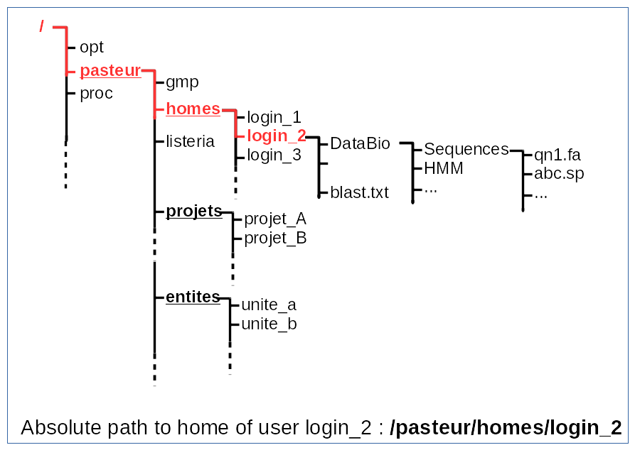
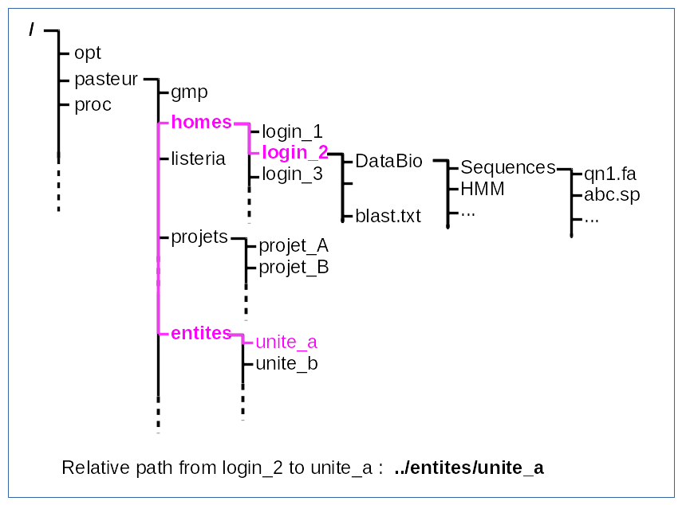

.. _Connect_IP_servers:

************************************
How and where to connect IP servers?
************************************

servers at pasteur
==================

 

   
how to connect to a remote server
=================================

Secure Shell (SSH) is a cryptographic network protocol for secure data communication.

* ssh remote_server -l login_name
* ssh login_name@remote_server

* on Mac osX ssh is available.
* on windows use **putty** **scputty**

exercise:

| connect to central-bio.pasteur.fr
| how to work on central from your "home sweet home" ?

where are your homes
====================

  
exercises:
  
* Go on you home.
* list your files and directories.

where are your unites
=====================

.. figure:: _static/images/unites_abs_path.png
   :class: align-center
   :width: 600px

exercises:
  
| Go in your unit directory.
| list your files and directories.
| try to go in the unit of your neighbor.
   
   
where are your project
======================

exercises:
  
| Go in project "*unix_training*\ ".
| list your files and directories.

relative path
=============

 
exercises:
  
| copy *Nucleique/Rv2048c.seq* in the *unix_training* project in your home.

put data from your PC to server
===============================

* put your data on you PC in @home => data will appear in your home dir.
* or your data on @unit_name  => data will appear in your unit dir.
  (this is the favorite method)
  
or

* **scp local_file login@remote_server:remote_path**
* **scp -r local_dir login@remote_server:remote_path**

 exercise:
  
| copy *il2.fasta.aln* in your central-bio.pasteur.fr home.

get data from server to your PC
===============================

* put the the data of your home dir or unit dir
  they will appear on your PC in @home or @unit_name volume.
* some projects are alseo accessible. 

or
 
| On Unix you can have a ssh server.
| *activate it on mac osX*
| the remote server become your PC.

why it's better to use @home/@unit
==================================

