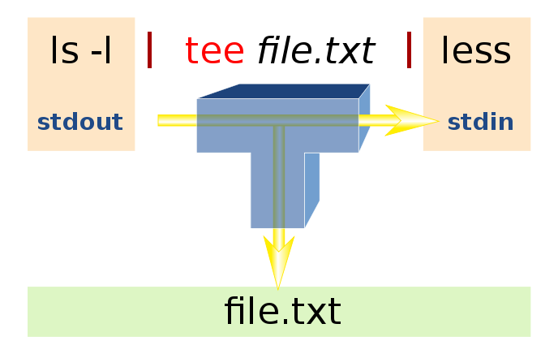

.. _Searching_And_Filtering:

***********************
Searching and Filtering
***********************

==================
Searching In Files
==================

grep
====

**print lines matching a pattern**

* **-i** (--ignore-case) Ignore case distinctions in both the PATTERN and the input files.
* **-v** (--invert-match) Invert the sense of matching, to select non-matching lines. 
* **-r** (--recursive) Read all files under each directory, recursively, following symbolic links only if they are on the command line.

* **-n** (--line-number) Prefix each line of output with the 1-based line number within its input file.

FASTA file format
=================

::

   >gi|5524211|gb|AAD44166.1| cytochrome b [Elephas maximus maximus]
   LCLYTHIGRNIYYGSYLYSETWNTGIMLLLITMATAFMGYVLPWGQMSFWGATVITNLFSAIPYIGTNLV
   EWIWGGFSVDKATLNRFFAFHFILPFTMVALAGVHLTFLHETGSNNPLGLTSDSDKIPFHPYYTIKDFLG
   LLILILLLLLLALLSPDMLGDPDNHMPADPLNTPLHIKPEWYFLFAYAILRSVPNKLGGVLALFLSIVIL
   GLMPFLHTSKHRSMMLRPLSQALFWTLTMDLLTLTWIGSQPVEYPYTIIGQMASILYFSIILAFLPIAGX
   IENY

FASTQ file format
=================

::

   @SEQ_ID
   GATTTGGGGTTCAAAGCAGTATCGATCAAATAGTAAATCCATTTGTTCAACTCACAGTTT
   +
   !''*((((***+))%%%++)(%%%%).1***-+*''))**55CCF>>>>>>CCCCCCC65

Exercises
=========

* count the number of sequences in the file 'abcd.fa' (a multiple fasta file)
* can we have the same approach with a fastq file?

grep with Regular Expressions
=============================

* **grep -E** or **egrep**
* Regular Expressions: sequences of characters to express a pattern
* useful metacharacters:

  * **.** any character
  * **[]** bracket expressions
  * **^** start of the string
  * **$** end of the string
  * **\*** match 0 to *n* times the preceding element
  * **{m,n}** match *m* to *n* times the preceding element
  * **(one|two)** match the strings "one" or "two"

Exercises
=========

* find the names of all the genes in the zipped FASTA file abcd.fa.gz
  in the unix_training project directory of central-bio.

* in the file abcd_sequences.gb, in the unix_training project directory of
  central-bio, find the origin organism of all the sequence entries 
  (tip: it's on a line with the ORGANISM keyword). 

=========================
Filtering/sorting results
=========================
 

cut
===

* **cut** - remove sections from each line of files
* ``cut OPTION... [FILE]``

* **-d DELIM**   use DELIM instead of TAB for field delimiter
* **-f** select only these fields

::

   who | cut -d ' ' -f 1 
   find . -atime 0 | cut -d '/' -f 2,3
   
sort
====

* **sort** - sort lines of text files
* ``sort [OPTION]... [FILE]``

* **-k** --key=KEYDEF sort via a key, KEYDEF gives location and **type**.
* **-n** (--numeric-sort) compare according to string numerical value (OBSOLETE).
* **-r** (--reverse) reverse the result of comparisons.

::

   who | cut -d ' ' -f 1 | sort | uniq -c | sort -k 1n,2
   
Exercise
========

We ran a blast with -m8 output. So the following fields are displayed

| id, percent identity, alignment length, number of mismatches, 
| number of gap openings, query start, query end,
| subject start, subject end, 
| Expect value, HSP bit score

Exercise (continued)
====================

separated by ``tab``.

#. copy the file *blast2_m8.txt* in the project of the course in your home.
#. sort the output folowing the % of identity (the highest identity to the top)
#. display only columns id of hit, percent identity, Expect value, HSP bit score
#. store the results in a new file.

uniq
====

report or omit repeated lines (Filter :red:`adjacent` matching lines)

* **uniq [OPTION] INPUT**
* **-c** prefix lines by the number of occurrences.

Exercise
========

* eliminate duplicates from the list of organisms 
  gathered from abcd_sequences.gb.

* from the same blast output than previous exercise,
  display all sequence ids that match with the query.

xargs
=====
 
build and execute command lines from standard input
xargs executes the command with any initial-arguments 
followed by items read from standard input.

Do not forget to add -l to process standard input line by line

::

   find . -name '*.fasta' | xargs grep ">"

* **-I** allows you to insert the line from the standard input
  somewhere else than in the end of the command

::

   find . -name '*.fasta' | xargs -I fic cat fic >>allmysequences

tee
===

* tee copies its input stream to the standard output and the files
  specified in argument

image from http://en.wikipedia.org/wiki/Tee_%28command%29#mediaviewer/File:Tee.svg

wget
====

* wget is a command line utility to retrieve content from _web servers_.

::

   wget http://www.uniprot.org/uniprot/ABCD1_MOUSE.fasta

* wget also supports many different options, such as ftp, authentication, etc.
