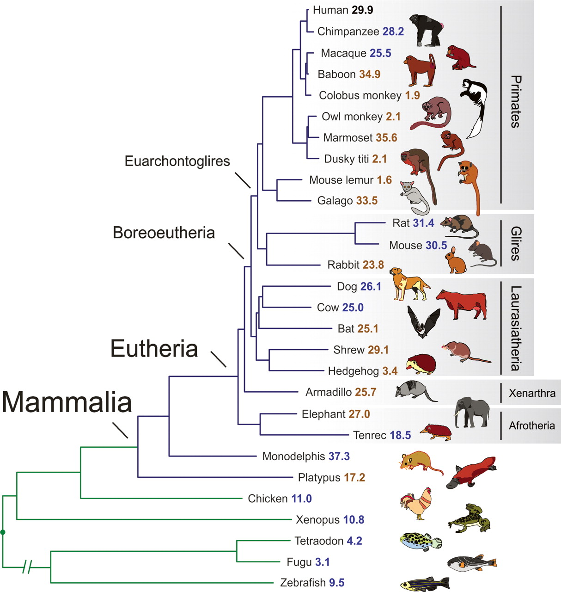
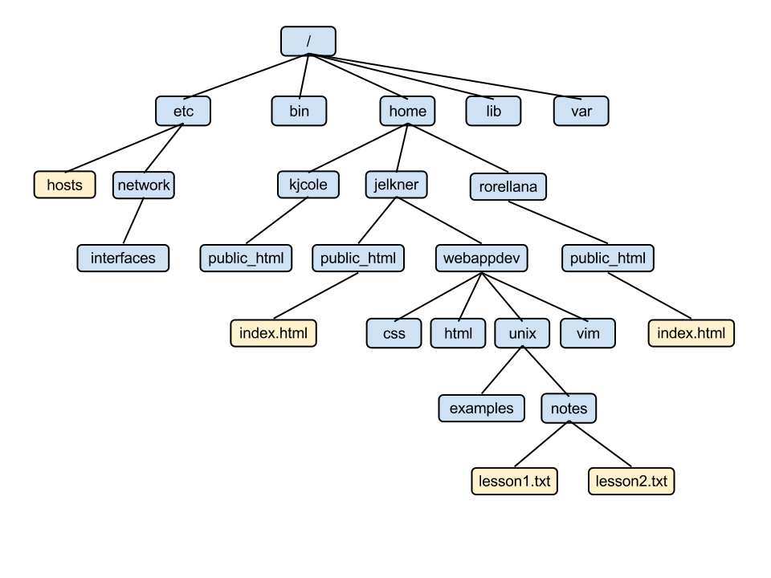

% Unix I
% Bertrand Néron, Hervé Ménager
% October 20-21th, 2014

# UNIX!

## What is Unix?

- Unix, Linux, *nix, …. : What is it?
- Operating System
- Created in  1969 in the Bell Labs
- Multi-user
- Multi-task
- Protected memory
- Unix family: BSD, Linux,  Mac OS X (Darwin), Android, etc.

## Why use Unix on the computing servers of the Institut Pasteur?

- Fares well in the scientific domain
- Multi-user
- Versatile
- Powerful

# The Unix Shell

## What is the Unix shell?

- a shell is a user interface for access to an **operating system**'s services.
- a shell can be a **command line interface** or a **graphical user interface**
- in a command line interface, the user issues commands to the program in the form of successive lines of text (command lines).
- what is commonly referred as "Unix shell" is a set of commonly-used CLI programs.

## Hands on:

- Open your "Unix machine"
- Open a terminal

## Commands

- A command is an instruction you send to the shell to ask it to execute an action.

## Syntax: command, options, arguments

- the command: what action should be executed
- the arguments: the object of the action
- the options: flags that specify or modify the behaviour of the command

Example: ls

> ls -l

> ls ~

# The File system
Are you familiar with this?

# The file system

- Programs store data in files on disks.
- A file system is the way the files are stored on a disk.
- In Unix, the files are organized in a hierarchical structure of directories that contains other directories and/or files.

# Basic commands

## work with directories

### ls

- <b>l</b>i<b>s</b>t the contents of a directory

### pwd

- display currrent directory 
- <b>p</b>rint <b>w</b>orking <b>d</b>irectory

### mkdir

- create one or more directories
- <b>m</b>a<b>k</b>e <b>d</b>irectories

## display/print files

### more

### less

### cat

### head

### tail

## work with files

### cp

### mv

### rm

## get help

## info

## man

## cut, ta

# Tasks management and chaining

# How and where to connect on the IP servers?

- ssh!
- login+password: your identity for the IP
- gateway to IP servers from off-campus:

> ssh.pasteur.fr

- Putty

# Thank you

- The initial contents of this training session was created by Eric Deveaud (CIB)
